Second year CS at <b>BITS Pilani</b> &#215; <b>Scaler School of Technology</b>. 
I build AI agents, reinforcement learning environments, and security tooling.

---

### Building

| Project | What it is |
| :-- | :-- |
| **Yojaka** | Real-time AI debate platform. Multiple agents argue a motion in a structured reasoning format. Next.js. |
| **Incident Response OpenEnv** | RL-compatible agent environment that simulates microservice failures with a diagnostic action mechanic. Deployed on HuggingFace Spaces. |
| **PROCTOR.AI** | B2B platform that scores AI-assisted engineering skill in technical interviews. Model-agnostic scoring core. |
| **ThreatSim** | Cybersecurity attack / defense simulator. Tech Excellence Award. |

### Selected work

- Top 100 solo finalist, **Meta &#215; PyTorch Hackathon** (built the incident-response RL environment end to end)
- Open source contributor to **Jaeger** GenAI observability (jaegertracing/jaeger-ui #3887, LFX Mentorship)
- Top 1% delegate, **Japan Youth Summit 2025** (UNESCO affiliated), pitched an AI cybersecurity education model
- Runner-up, **Arweave Hackathon**

### Stack

**Languages**&#160;&#160;`TypeScript` `Python` `Go` `C++` `Java`
**Frameworks**&#160;&#160;`Next.js` `React` `FastAPI` `Node`
**Infra**&#160;&#160;`Docker` `Postgres` `Redis` `GCP`
**Focus**&#160;&#160;`LLM agents` `reinforcement learning` `observability` `appsec`

This header is a single hand-written animated SVG.

