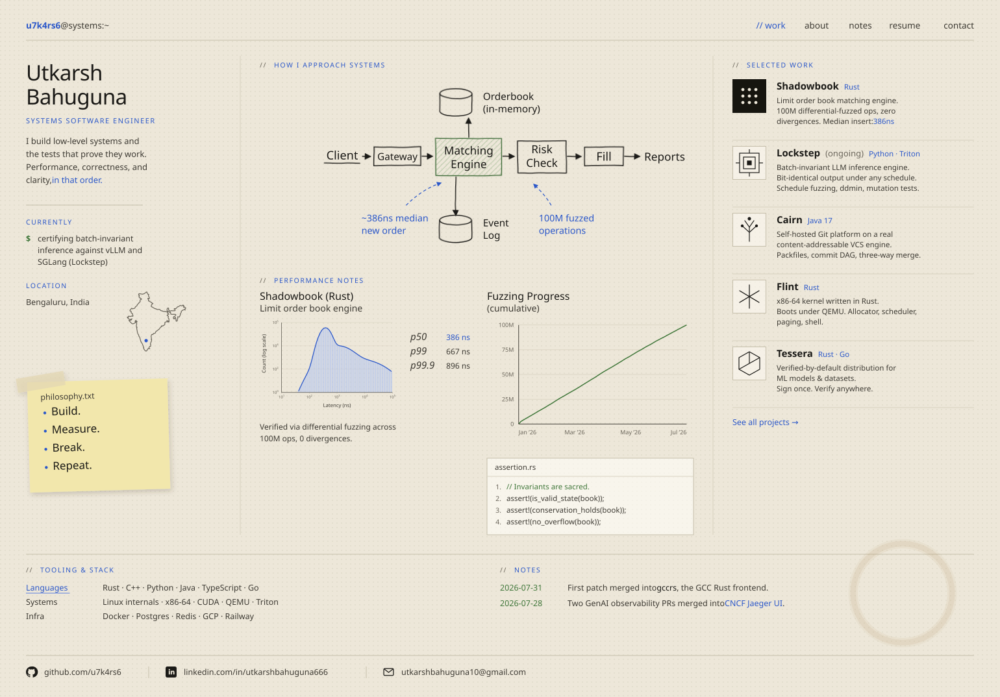

CS undergrad at <b>BITS Pilani</b> &#215; <b>Scaler School of Technology</b>. 
I build systems that verify themselves. Inference engines, matching engines, kernels, and the adversarial harnesses that prove they hold.

---

### Building

| Project | What it is |
| :-- | :-- |
| **[Lockstep](https://github.com/u7k4rs6/LockStep)** | Batch-invariant LLM inference engine plus the adversarial schedule fuzzer that proves the invariance. Same seed, bit-identical output regardless of batch composition, arrival order, preemption, or cache eviction. Paged KV, continuous batching, fixed-reduction Triton kernels. |
| **[Shadowbook](https://github.com/u7k4rs6/Shadowbook)** | Single-instrument limit order book matching engine in Rust. 100M differential-fuzzed operations against a reference oracle, zero divergences. 386ns p50 insert, zero hot-path allocations. |
| **[Tessera](https://github.com/u7k4rs6/Tessera)** | Poisoning-resistant distribution for ML models and datasets. Publisher signs once, untrusted mirrors distribute, any consumer verifies the exact signed bytes with full provenance. Tamper-evident, replay-proof, revocation-aware. |
| **[CAIRN](https://github.com/u7k4rs6/CAIRN)** | Self-hosted Git platform in Java, built on a real content-addressable VCS engine. Packfiles with delta compression, commit DAG with generation numbers, Myers diff, three-way merge, trigram code search. Cross-verified against the git binary and live over smart-HTTP. |
| **[Flint](https://github.com/u7k4rs6/Flint)** | Bootable x86-64 kernel in Rust running under QEMU. Physical and virtual memory, allocator, scheduler, interrupt handling, and a shell. |
| **[Starling](https://github.com/u7k4rs6/Starling)** | Real-time collaborative text editor built on a Fugue CRDT. Treap-backed document, binary wire encoding, relay and provider, ProseMirror binding. Published as `starling-crdt`. |
| **[MIRR](https://github.com/u7k4rs6/MIRR)** | Simulation lab for training and evaluating agents that diagnose and recover microservice incidents. Built for the Meta &#215; PyTorch hackathon, live Gradio demo. |

### Open source

Merged upstream:

- **gccrs** (GCC Rust frontend) [#4731](https://github.com/Rust-GCC/gccrs/pull/4731) &#160;&#183;&#160; dead-code lint missed types used as generic arguments
- **jaeger-ui** (CNCF) [#4053](https://github.com/jaegertracing/jaeger-ui/pull/4053), [#4271](https://github.com/jaegertracing/jaeger-ui/pull/4271) &#160;&#183;&#160; GenAI span classification and trace detection
- **huggingface/OpenEnv** [#742](https://github.com/meta-pytorch/OpenEnv/pull/742) &#160;&#183;&#160; SSRF-safe URL parser
- **NVIDIA/garak** [#1842](https://github.com/NVIDIA/garak/pull/1842) &#160;&#183;&#160; Bedrock generator parameter suppression
- **dottxt-ai/outlines** [#1867](https://github.com/dottxt-ai/outlines/pull/1867) &#160;&#183;&#160; RFC 4291 IPv6 structured-output type
- **vllm-project/llm-compressor**, **llm-guard**, **AI Village**

In review: a duplicate `extern crate` diagnostic in gccrs, a path-traversal red-team plugin in promptfoo, a code-attack converter in Microsoft PyRIT, media rendering in jaeger-ui.

### Research

- **When Self-Consistency Backfires** &#160;&#183;&#160; where sampling more and voting makes reasoning worse rather than better. Submitted to COLM 2026 Workshop.
- Filed an exact failing-set predicate on an open PyTorch numerics issue ([#147284](https://github.com/pytorch/pytorch/issues/147284)) while building Lockstep's fp64 reference.

### Selected work

- Global Top 20 finalist, **Meta &#215; PyTorch Hackathon**
- Delegate, **Harvard HPAIR 2026**
- Top 1% delegate, **Japan Youth Summit 2025** (UNESCO affiliated)
- Tech Excellence Award and ISRO acknowledgment for **ThreatSim**

### Stack

**Languages**&#160;&#160;`Rust` `C++` `Python` `Java` `TypeScript` `Go`
**Systems**&#160;&#160;`Triton` `CUDA` `QEMU` `Linux internals` `x86-64`
**Infra**&#160;&#160;`Docker` `Postgres` `Redis` `GCP` `Railway`
**Focus**&#160;&#160;`inference systems` `differential testing` `fuzzing` `compilers` `observability`

<a href="https://u7k4rs6.github.io/Utkarsh-CV/">Portfolio</a> &#160;&#183;&#160;
<a href="https://linkedin.com/in/utkarshbahuguna666">LinkedIn</a> &#160;&#183;&#160;
<a href="mailto:utkarshbahuguna10@gmail.com">Email</a>

