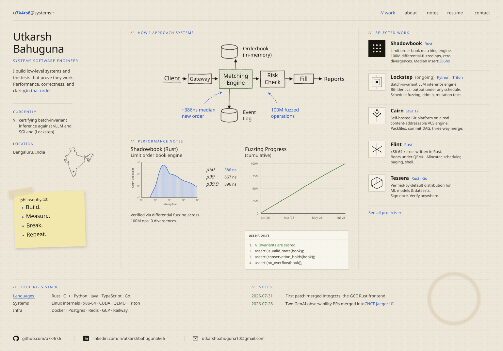

CS at <b>BITS Pilani</b> &#215; <b>Scaler School of Technology</b>. I build systems, then build the harnesses that break them. 
<b>23 PRs merged upstream</b> into GCC, Microsoft, NVIDIA, Hugging Face, CNCF and vLLM projects.

---

- **I have a patch in GCC master.** [gccrs#4731](https://github.com/Rust-GCC/gccrs/pull/4731) went upstream in a maintainer's sync with my authorship kept.
- **I found nondeterminism in vLLM's deterministic mode** ([vllm#51187](https://github.com/vllm-project/vllm/issues/51187)) and built the trace that pinned it down: 16 server lifetimes, 1,120 comparisons, zero exceptions. Repeats match if and only if every token was reduced at the same RMSNorm block width.
- **I'm the sole author of a COLM 2026 workshop paper.** [When Self-Consistency Backfires](https://arxiv.org/abs/2608.11403) shows majority voting *lowers* accuracy on 56–66% of GPQA Diamond problems. v2 corrects its own mechanism claim.

### Open source

| Project | Merged |
| :-- | :-- |
| **[gccrs](https://github.com/Rust-GCC/gccrs/pulls?q=is%3Amerged+author%3Au7k4rs6)** · GCC Rust frontend | 4 PRs: a dead-code lint fix (now in GCC master), rustc-compatible `E0259`/`E0260`, a parser segfault I found and filed, and generic param handling |
| **[microsoft/PyRIT](https://github.com/microsoft/PyRIT/pulls?q=is%3Amerged+author%3Au7k4rs6)** | 7 PRs: the CodeAttack converter and technique, plus fixes to TAP/PAIR, multi-turn attacks, dataset loaders and seed filtering |
| **[jaeger-ui](https://github.com/jaegertracing/jaeger-ui/pulls?q=is%3Amerged+author%3Au7k4rs6)** · CNCF | 4 PRs: GenAI span classification, image/audio rendering, RFC wire-format corrections |
| **[NVIDIA/garak](https://github.com/NVIDIA/garak/pull/1842)** | Fixed Bedrock scans that failed for every Claude 4.x user |
| **[huggingface/OpenEnv](https://github.com/huggingface/OpenEnv/pull/742)** | SSRF-safe URL parsing |
| **[dottxt-ai/outlines](https://github.com/dottxt-ai/outlines/pull/1867)** | RFC 4291 IPv6 structured-output type |
| **Also** | vllm-project/llm-compressor ×2, openkruise/agents, AI Village ×2 |

### Building

| | |
| :-- | :-- |
| **[Lockstep](https://github.com/u7k4rs6/LockStep)** | An LLM inference engine plus a certifier that checks output stays bit-identical however requests are batched, preempted or evicted. Triton kernels, paged KV. |
| **[Shadowbook](https://github.com/u7k4rs6/Shadowbook)** | A limit order book in Rust. 416ns p50 insert, 100M fuzzed ops against an oracle with zero divergences, and zero hot-path allocation enforced by an allocator. |
| **[Starling](https://github.com/u7k4rs6/Starling)** | A collaborative editor on a Fugue CRDT. 60,000 deletions encode to 15 bytes. Published as `starling-crdt`. [Demo](https://u7k4rs6.github.io/Starling/) |
| **[CAIRN](https://github.com/u7k4rs6/CAIRN)** | A Git platform in Java on its own VCS engine. Real `git` clones, pushes and fetches against it. [Live](https://cairn.utkarshbahuguna.me) |
| **[Flint](https://github.com/u7k4rs6/Flint)** | An x86-64 kernel in Rust, with ring 3 isolation proven by a breakout harness. |
| **[MIRR](https://github.com/u7k4rs6/MIRR)** | An incident-response environment for agents. Global top 20 at the Meta × PyTorch Hackathon. [Space](https://huggingface.co/spaces/u7k4rs6/Metafinal) |

I publish what the measurements say. When all-pairs comparison showed half of a Lockstep finding was an artifact, the retraction went next to the result.

<code>Rust</code> <code>C++</code> <code>Python</code> <code>CUDA/Triton</code> <code>Go</code> <code>Java</code> <code>TypeScript</code>
  
<a href="https://utkarshbahuguna.me">Portfolio</a> &#160;&#183;&#160;
<a href="https://linkedin.com/in/utkarshbahuguna666">LinkedIn</a> &#160;&#183;&#160;
<a href="mailto:utkarshbahuguna10@gmail.com">Email</a>

